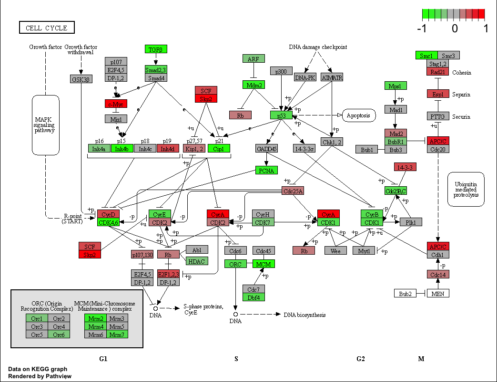
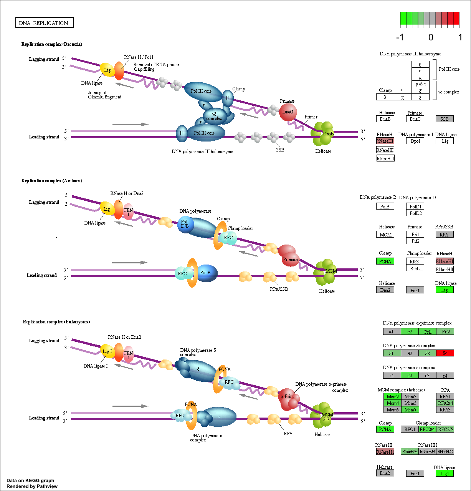

2. Import countData and colData

```{r}
counts <- read.csv("airway_scaledcounts.csv", row.names=1)
metadata <-  read.csv("airway_metadata.csv")
```

Have a look at each

```{r}
head(counts)
```

```{r}
metadata
```

>Q1. How many genes are in this dataset? 

```{r}
nrow(counts)
```
38694 

>Q2. How many ‘control’ cell lines do we have? 

```{r}
sum(metadata$dex =="control")
```
4 


First I need to extract all of the "control" columns. Then I need to take the row-wise mean to get the average count values for all genes in these four experiments. 
```{r}
control.inds <- metadata$dex == "control"
control.counts <- counts[, control.inds]
head(control.counts)
```

```{r}
control.mean <- rowMeans(control.counts)
```

>Q3. How would you make the above code in either approach more robust?

To make the above code in either approach more robust, we could use the general approach in calculating the mean, such that the mean will be correct even when our dataset changes.


>Q4. Follow the same procedure for the treated samples (i.e. calculate the mean per gene across drug treated samples and assign to a labeled vector called treated.mean)

```{r}
treated.inds <- metadata$dex == "treated"
treated.counts <- counts[, treated.inds]
head(treated.counts) 
treated.mean <- rowMeans(treated.counts)
```

Then combine our meancounts data
```{r}
meancounts <- data.frame(control.mean, treated.mean) 
```


>Q5 (a). Create a scatter plot showing the mean of the treated samples against the mean of the control samples. Your plot should look something like the following.
Make a plot of control vs treated
```{r}
plot(meancounts)
```

>Q5 (b).You could also use the ggplot2 package to make this figure producing the plot below. What geom_?() function would you use for this plot? 
geom_point


>Q6. Try plotting both axes on a log scale. What is the argument to plot() that allows you to do this?
meancounts, log="xy"

```{r}
plot(meancounts, log="xy")
```

We often use log2 in this field because it has nice math properties that make interpretation easier

```{r}
log2(10/10)
```

```{r}
log2(20/10)
```

```{r}
log2(40/10)
```

```{r}
log2(5/10)
```

We see 0 values for no change, + values for increases, and - values for decreases. This nice property leads us to work with **log2(fold-change)** all the time in genomics and proteomics filed. 

Now add the **log2(fold-change)** values to the meancounts dataframe.
```{r}
meancounts$log2fc <- log2(meancounts[,"treated.mean"]/meancounts[,"control.mean"])
head(meancounts)
```

We see some infinities in the data so we need to filter them out.
```{r}
head(meancounts[,1:2] ==0)
```
I can use the **which()** function with the 'arr.ind=TRUE' argument to get the columns and rows where the TRUE values are (i.e. the zero counts)

```{r}
zero.vals <- which(meancounts[,1:2] ==0, arr.ind = TRUE)
head(zero.vals) 
```

>Q7. What is the purpose of the arr.ind argument in the which() function call above? Why would we then take the first column of the output and need to call the unique() function?

The arr.ind argument will allow the function to return the rows and columns that have TRUE values (the zeros in our data). The unique() function is used to ensure that the function doesn't count a row twice if both the control and treated have TRUE.

```{r}
to.rm <- unique(zero.vals[, "row"])
head(sort(to.rm))
```

Now we can remove these from our 'meancounts' dataframe.

```{r}
head(meancounts)
```


```{r}
mycounts <- meancounts[-to.rm,]
head(mycounts) 
```

How many genes are left?
```{r}
nrow(mycounts)
```

> Q8. Using the up.ind vector above can you determine how many up regulated genes we have at the greater than 2 fc level? 

250

```{r}
up.ind <- sum(mycounts$log2fc > 2)
up.ind
```

> Q9. Using the down.ind vector above can you determine how many down regulated genes we have at the greater than 2 fc level? 

367

```{r}
down.ind <- sum(mycounts$log2fc < (-2))
down.ind
```


> Q10. Do you trust these results? Why or why not?

I do not trust these results because I am not sure of whether these changes are statistically significant. We aren't accounting for fold changes and significance, and thus could be a cause of statistical insignificance.


4. DeSEQ Analysis

Lets do this the right way. DESeq2 is an R-package specifically for analyzing count based NGS data like RNA-seq. It is available from Bioconductor.

```{r}
library(DESeq2)
citation("DESeq2")
```

```{r}
dds <- DESeqDataSetFromMatrix(countData=counts, 
                              colData=metadata, 
                              design=~dex)
dds
```

Now run the DESeq analysis

```{r}
dds <- DESeq(dds)
```

Results using the DESeq 'results()' function: 
```{r}
res <- results(dds)
res
```


5. Adding Annotation Data

```{r}
BiocManager::install("AnnotationDbi")
BiocManager::install("org.Hs.eg.db")
library("AnnotationDbi")
library("org.Hs.eg.db")
```

Examine what is in `org.Hs.eg.db` 

```{r}
columns(org.Hs.eg.db)
```

Use the mapIDs() function to add individual columns to our results table.

```{r}
res$symbol <- mapIds(org.Hs.eg.db,
                     keys=row.names(res),
                     keytype="ENSEMBL",
                     column="SYMBOL",
                     multiVals="first")
```

```{r}
head(res)
```

> Q11. Run the mapIds() function two more times to add the Entrez ID and UniProt accession and GENENAME as new columns called res$entrez, res$uniprot and res$genename.

```{r}
res$entrez <- mapIds(org.Hs.eg.db,
                     keys=row.names(res),
                     column="ENTREZID",
                     keytype="ENSEMBL",
                     multiVals="first")
res$uniprot <- mapIds(org.Hs.eg.db,
                     keys=row.names(res),
                     column="UNIPROT",
                     keytype="ENSEMBL",
                     multiVals="first")
res$genename <- mapIds(org.Hs.eg.db,
                     keys=row.names(res),
                     column="GENENAME",
                     keytype="ENSEMBL",
                     multiVals="first")
head(res)
```

6. Make a Volcano plot
Let’s make a commonly produced visualization from this data, namely a so-called Volcano plot. These summary figures are frequently used to highlight the proportion of genes that are both significantly regulated and display a high fold change.

Let's use base R
```{r}
plot(res$log2FoldChange, res$padj)
```

The above plot is not so useful because all smaller p-values are hidden at the bottom of the plot, and as a result, is hard to see. use log!
```{r}
plot(res$log2FoldChange, log(res$padj))
```

Then, use -log to flip the p-value.
```{r}
plot(res$log2FoldChange, -log(res$padj))
```

Now let's add guidelines: labels and colors, to the plot to draw attention to the genes (points on the graph) we care about. These are the ones that have large fold-changes and low p-values.

first, labels
```{r}
 plot(res$log2FoldChange, -log(res$padj), ylab="-Log(P-value)", xlab="Log2(FoldChange)")
abline(v=c(-2, +2), col="gray")
abline(h=-log(0.05), col="gray")
```

Now add color!
```{r}
mycols <- rep("gray", nrow(res))
mycols[ abs(res$log2FoldChange) > 2 ]  <- "red" 
inds <- (res$padj < 0.01) & (abs(res$log2FoldChange) > 2 )
mycols[ inds ] <- "blue"
plot( res$log2FoldChange,  -log(res$padj), 
col=mycols, ylab="-Log(P-value)", xlab="Log2(FoldChange)")
abline(v=c(-2,2), col="gray", lty=2)
abline(h=-log(0.1), col="gray", lty=2)
```

7. Pathway Analysis
```{r}
#BiocManager::install( c("pathview", "gage", "gageData") )
```

```{r}
library(pathview)
library(gage)
library(gageData)
data(kegg.sets.hs)
# Examine the first 2 pathways in this kegg set for humans
head(kegg.sets.hs, 2)
```

The main **gage()** function requires a named vector of fold changes, where the names of the values are the Entrez gene IDs. Note that we used the mapIDs() function above to obtain Entrez gene IDs (stored in res$entrez) and we have the fold change results from DESeq2 analysis (stored in res$log2FoldChange).

```{r}
foldchanges = res$log2FoldChange
names(foldchanges) = res$entrez
head(foldchanges)
```

```{r}
# Get the results
keggres = gage(foldchanges, gsets=kegg.sets.hs)
```

Now lets look at the object returned from gage().
```{r}
attributes(keggres)
```

```{r}
# Look at the first three down (less) pathways
head(keggres$less, 3)
```

```{r}
pathview(gene.data=foldchanges, pathway.id="hsa05310")
```


```{r}
# A different PDF based output of the same data
pathview(gene.data=foldchanges, pathway.id="hsa05310", kegg.native=FALSE)
```

> Q12. Can you do the same procedure as above to plot the pathview figures for the top 2 down-regulated pathways?

```{r}
pathview(gene.data=foldchanges, pathway.id="hsa04110")
```


```{r}
pathview(gene.data=foldchanges, pathway.id="hsa03030")
```

